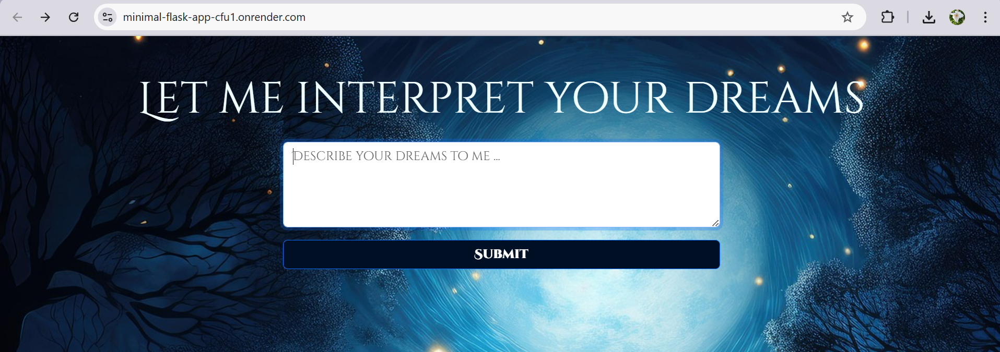
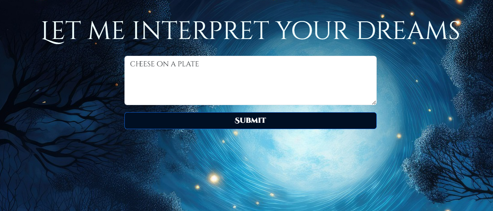
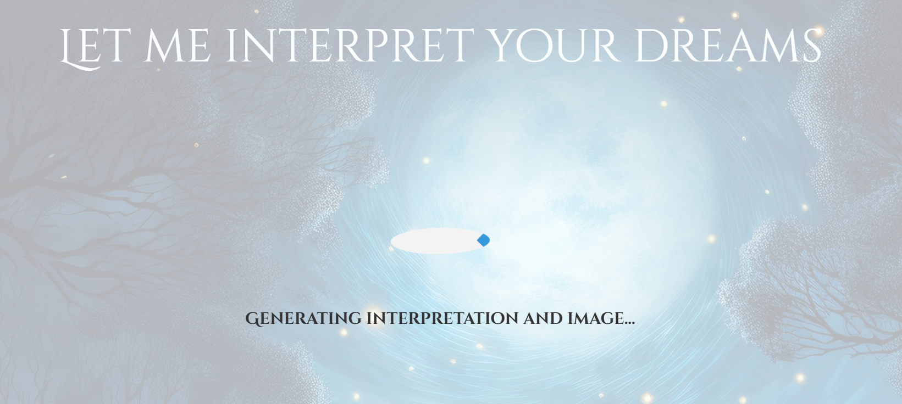
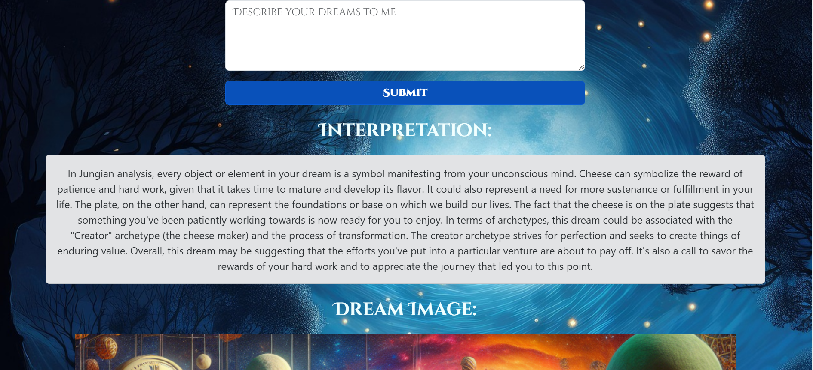
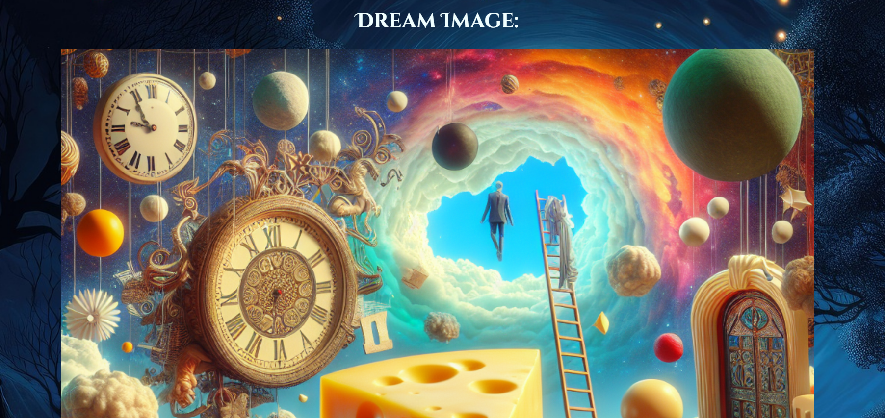

# dream-app

# How to run the app

```
# Create virtual environment
python3 -m venv ./venv

# Activate your virtual environment
source venv/bin/activate

# Install the required packages. For example
pip3 install flask openai python-dotenv

# Rename the file .env-bup to .env. 
# Add your OPENAI_API_KEY to the .env file.

# Run the app
python3 app.py
```

# Dream Doctor Project Report

For this app, I implemented a Jungian dream interpreter based on the user's input from the form with a Submit button.  I also implemented a Jungian dream image generator based on the user's input. In order to implement the Jungian dream interpreter , I used OpenAI completions in conjuction with the GPT-4 model. I input the following:
content for system role: "You are a Jungian analyst. Interpret dreams based on Jungian psychology, using archetypes, the collective unconscious, and symbolic meaning.". As for the
User content I input: f"Dream: {dream_description}". I set the temperature to 0.8 and the max tokens value. When it comes to Jungian dream image generator, I used the DALL-E-3 model and used the prompt.
: f"A surreal and symbolic visual representation of this dream: {dream_description}. Focus on archetypal symbols, like figures, actions, and settings.".

While building this web app, I encountered several issues. For example, I was not aware of how to build a Flask app with custom styles and images. For this assignment, I had to research how to implement custom styles and static images
with the appropriate folder structure to store my CSS files and images. Furthermore, when working on my dream interpreter, I also had issues with retrieving the image URL that is being generated. In fact, I tried to follow OpenAI's documentation on image
generation : where I had to create an image from the client object. However, this did not work for my implementation of retrieving the OPEN_AI_API Key, so I had to do some research and instead of generating an image from the client object, I did it by calling the generate method on OpenAI object.

When testing this web app, I noticed that it takes several seconds to get a response from the OpenAI's API. I decided to implement a
loading an object in my web app for a cleaner UI. I feel like this decision improved the overall look and usability of my app.

Some future improvements for this web app would be to create separate pages for user input about their dream, the Jungian dream interpreter, and the Jungian dream image generator. The user would scroll through the output of the app using buttons. This 
would contribute to make the app more interactive.

# User guide for the web application

1.Load the web app at : https://minimal-flask-app-cfu1.onrender.com/



2.Input your last dream in a textbox.



3.Wait a couple seconds, and enjoy your dream analysis !



4.To analyze new dreams, simply write your new dreams in textbox.





